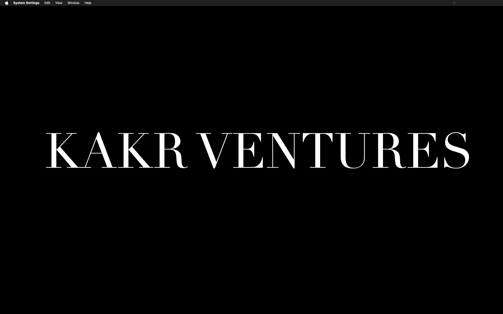

<p align="center">
  
</p>

<h1 align="center">GitPanel</h1>

<p align="center">
  <strong>Live Git Status in Your Menu Bar — Built for Claude Code</strong>
</p>

<p align="center">
  
  
  
  
  
</p>

<p align="center">
  <a href="#quick-start">Quick Start</a> •
  <a href="#features">Features</a> •
  <a href="#screenshots">Screenshots</a> •
  <a href="#keyboard-shortcuts">Shortcuts</a> •
  <a href="#privacy">Privacy</a> •
  <a href="#contributing">Contributing</a>
</p>

---

## What is GitPanel?

GitPanel is a **macOS menu bar app** that gives you **real-time git visibility** without breaking your flow. Built specifically for **Claude Code** users who need to see what's happening in their repo while the AI works.

> **No more terminal switching.** No more `git status` every 5 seconds. GitPanel watches your repo and shows you everything — instantly.

---

## Quick Start

### Option 1: Build from Source

```bash
git clone https://github.com/vaib2607/GitPanel-Live-Git-Status-in-Menu-Bar-for-Claude-Code.git
cd GitPanel-Live-Git-Status-in-Menu-Bar-for-Claude-Code
bash build.sh
open GitPanel.app
```

### Option 2: One-Line Install

```bash
curl -sL https://raw.githubusercontent.com/vaib2607/GitPanel-Live-Git-Status-in-Menu-Bar-for-Claude-Code/main/install.sh | bash
```

### Option 3: Download Release

Download the latest `.app` from [Releases](https://github.com/vaib2607/GitPanel-Live-Git-Status-in-Menu-Bar-for-Claude-Code/releases).

---

## Screenshots

<p align="center">
  
</p>

<p align="center">
  <em>Main panel showing diff summary, file stats, and commit actions</em>
</p>

<br>

<p align="center">
  
</p>

<p align="center">
  <em>Branch switcher with search, create, and context menu</em>
</p>

<br>

<p align="center">
  
</p>

<p align="center">
  <em>Commit, Push, and Commit & Push buttons</em>
</p>

---

## Features

### Live Repo Status
FSEvents-powered **instant refresh**. Changes appear the moment you stage, commit, or modify files. No polling. No delays. The 300ms debounce keeps everything smooth.

### Diff Summary
See **lines added**, **lines deleted**, **staged vs unstaged** files, **untracked** files, and **merge conflicts** — all in one clean card.

### Branch Switcher
Searchable branch list with **create-new-branch** support. Right-click any branch to **checkout**, **copy name**, or **delete**. See **ahead/behind badges** so you know where you stand.

### Commit & Push
Three separate actions:
- **Commit** — stage and commit
- **Push** — push existing commits
- **Commit & Push** — do both in one step

### PR Status
Shows your **open pull requests** with title, author, and review status — powered by the GitHub CLI (`gh`).

### Repo State Detection
GitPanel knows when you're in a **rebase**, **cherry-pick**, **revert**, **bisect**, or **merge conflict**. The icon changes to reflect the current state.

### Dynamic Menu Bar Icon
The icon **changes based on your repo**:
- `⌘` Clean
- `↑` Dirty / has changes
- `!` Merge conflict
- `⎇` Rebase / cherry-pick / revert / bisect

### Claude Code Usage
See your **real token counts** and **cost** from Claude Code offline logs. Best-effort Cursor plan tier detection.

### Drag & Drop
**Drop files from Finder** directly onto the panel to stage them.

---

## Keyboard Shortcuts

<table>
<tr>
<td align="center" width="33%">

<kbd>⌘</kbd> + <kbd>R</kbd>

**Refresh**

</td>
<td align="center" width="33%">

<kbd>⌘</kbd> + <kbd>↵</kbd>

**Commit**

</td>
<td align="center" width="33%">

<kbd>⌘</kbd> + <kbd>⇧</kbd> + <kbd>↵</kbd>

**Commit & Push**

</td>
</tr>
</table>

---

## How It Works

```
┌─────────────────────────────────────────────────────────┐
│  macOS Menu Bar                                         │
│  ┌─────┐                                                │
│  │ ⌘ > │ ← Dynamic icon changes based on repo state    │
│  └─────┘                                                │
│      ↓ Left-click                                       │
│  ┌─────────────────────────────────────────────────┐   │
│  │  GitPanel Panel                                  │   │
│  │  ┌─────────────────────────────────────────┐    │   │
│  │  │ 📁 my-project                           │    │   │
│  │  │ Branch: main  ↑2  ↓1                   │    │   │
│  │  ├─────────────────────────────────────────┤    │   │
│  │  │ Diff Summary                            │    │   │
│  │  │ +42 -18  │  Staged: 3  Unstaged: 5    │    │   │
│  │  ├─────────────────────────────────────────┤    │   │
│  │  │ Files Changed                          │    │   │
│  │  │  • Sources/main.swift    (+12, -3)     │    │   │
│  │  │  • Views/Panel.swift     (+8, -5)      │    │   │
│  │  │  • Services/Git.swift    (+22, -10)    │    │   │
│  │  ├─────────────────────────────────────────┤    │   │
│  │  │ [Commit] [Push] [Commit & Push]        │    │   │
│  │  └─────────────────────────────────────────┘    │   │
│  └─────────────────────────────────────────────────┘   │
└─────────────────────────────────────────────────────────┘
```

---

## Requirements

| Requirement | Required | Notes |
|-------------|----------|-------|
| macOS 13.0+ | ✅ | Ventura or later |
| Git | ✅ | Pre-installed on macOS |
| `gh` (GitHub CLI) | ❌ | Optional, for PR status |
| Xcode CLI Tools | ❌ | Only needed to build from source |

---

## Privacy

<details>
<summary><strong>🔒 GitPanel is 100% local. No data leaves your machine.</strong></summary>

<br>

| What | How | Network? |
|------|-----|----------|
| Git operations | Local `git` CLI | ❌ No |
| Usage data | Parsed from local JSONL logs | ❌ No |
| Settings | `UserDefaults` | ❌ No |
| PR status | Local `gh` CLI | ❌ No |
| Analytics | None | ❌ No |
| Tracking | None | ❌ No |

**GitPanel never makes outbound network connections.**

</details>

---

## Architecture

```
GitPanel/
├── Sources/
│   └── GitPanel/
│       ├── main.swift
│       ├── AppDelegate.swift
│       ├── Models.swift
│       ├── Services/
│       │   ├── ShellRunner.swift
│       │   ├── GitService.swift
│       │   ├── GitHubService.swift
│       │   ├── RepoManager.swift
│       │   ├── UsageService.swift
│       │   ├── AppSettings.swift
│       │   └── FileWatcher.swift
│       └── Views/
│           ├── EnvironmentViewModel.swift
│           ├── EnvironmentPanel.swift
│           ├── BranchListView.swift
│           ├── UsageView.swift
│           ├── CommitSection.swift
│           ├── PRStatusRow.swift
│           ├── RepositoryInfoView.swift
│           ├── PanelStyles.swift
│           └── SettingsView.swift
├── Resources/
│   ├── Info.plist
│   ├── GitPanel.entitlements
│   ├── GitPanel.icns
│   └── model_prices.json
├── scripts/
│   ├── generate-icon.swift
│   └── capture-screenshots.sh
├── screenshots/
│   ├── 20260709_main_panel.png
│   ├── 20260709_branch_list.png
│   ├── 20260709_commit_view.png
│   └── 20260709_menu_bar.png
├── build.sh
├── install.sh
├── Package.swift
├── LICENSE
└── PRIVACY.md
```

---

## Roadmap

- [ ] Staging individual files from the panel
- [ ] Interactive rebase support
- [ ] Git stash management
- [ ] Commit message templates
- [ ] Diff viewer (inline changes)
- [ ] Multiple repo support
- [ ] Notification on push completion
- [ ] Customizable keyboard shortcuts

---

## Contributing

Contributions are welcome!

1. **Fork** the repo
2. **Create** a feature branch (`git checkout -b feature/amazing-feature`)
3. **Commit** your changes (`git commit -m 'Add amazing feature'`)
4. **Push** to the branch (`git push origin feature/amazing-feature`)
5. **Open** a Pull Request

### Development

```bash
git clone https://github.com/YOUR_USERNAME/GitPanel-Live-Git-Status-in-Menu-Bar-for-Claude-Code.git
cd GitPanel-Live-Git-Status-in-Menu-Bar-for-Claude-Code
swift build
swift run
```

---

## Support

- **Issues**: [GitHub Issues](https://github.com/vaib2607/GitPanel-Live-Git-Status-in-Menu-Bar-for-Claude-Code/issues)
- **Discussions**: [GitHub Discussions](https://github.com/vaib2607/GitPanel-Live-Git-Status-in-Menu-Bar-for-Claude-Code/discussions)

---

## License

MIT License — see [LICENSE](LICENSE) for details.

---

<p align="center">
  Made with ❤️ for Claude Code users
</p>

<p align="center">
  <a href="https://github.com/vaib2607/GitPanel-Live-Git-Status-in-Menu-Bar-for-Claude-Code/stargazers">
    
  </a>
  <a href="https://github.com/vaib2607/GitPanel-Live-Git-Status-in-Menu-Bar-for-Claude-Code/network/members">
    
  </a>
  <a href="https://github.com/vaib2607/GitPanel-Live-Git-Status-in-Menu-Bar-for-Claude-Code/issues">
    
  </a>
</p>
